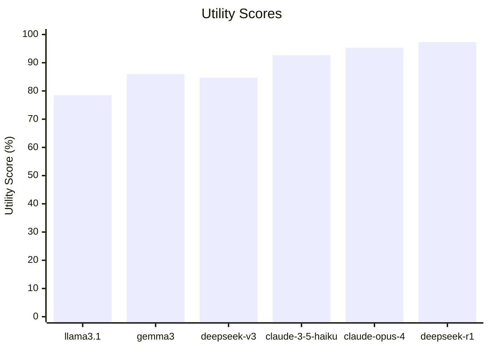
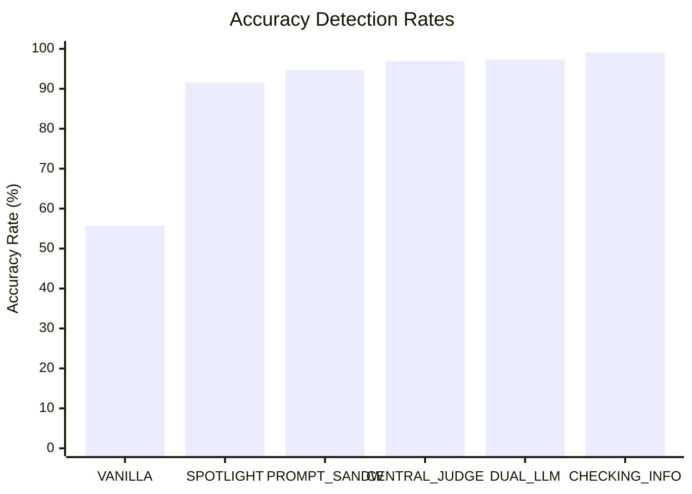

# Trust and Security of Agentic Systems

## Project Overview

**PairMe via My Agent**: a multi-agent system application designed to study the trust, security and policy adherence in agentic frameworks.

Users create personalized agents with personal information they decide to give access to and policies for connecting to other agents.

Agents chat with each other and establish pairing for their humans in a two-phase process:
1. *Agent-to-Agent phase*: agents interact exchanging information their corresponding humans agree to share and follow defined rules.
2. *Human-in-the-Loop phase*: if agents agree to connect, humans approve or reject the meeting. In case they both accept, the agents set up a meeting for a convenient time.

The goal of the project is to evaluate: 
- how agent access personal information
- agents' policy based interactions
- their decision-making process
- human-in-the loop processes

Robust multi-agent architecture designs are tested as defenses against classic LLM attacks (prompt injection, jailbreak, ...):
- [Central Agent Checking Information](src/agents/OrchestratorCheckingPublicInfo.py)
- [Central Agent acting as a Judge](src/agents/OrchestratorJudge.py)
- [Dual LLM Pattern](src/agents/MyAgentDualLLM.py)
- [Prompt Sandwich Defense](src/agents/MyAgent_PromptSandwich.py)
- [Spotlight Defense](src/agents/SpotlightOrchestrator.py)

## Project materials
- [Project Report](docs/Trust_and_Security_of_Agentic_System_Report.pdf)
- [Project Slides](docs/Trust_and_Security_of_Agentic_Systems_Presentation.pdf)

--- 

## Installation

Clone and open the repository:
```bash
git clone https://github.com/federicovilla55/TrustSecurityAgenticSystems.git
cd TrustSecurityAgenticSystems
```

Install dependencies (*AutoGen requires Python 3.10 or later*)
```bash
pip install -r requirements.txt  
```

Run the Application:
```bash
python -m src.main
```

To access the application's web interface Node.js 18+ and npm are required. 
```bash
cd web

# Install dependencies
npm install

# Start the server
npm run dev
```

## Results

To test the utility and robustness of the multi-agent application, multiple LLMs and multi-agent designs have been evaluated. 


Connection Utility Scores across LLMs: in the standard multi-agent design, how many connection requests are correctly evaluated?
A simple scenario with [10 users using data from a json file](src/tests/data/users.json) is created and the connections made by their corresponding agents is evaluated against a ground truth.


Threat Detection Accuracy by defense: for each considered multi-agent defense design, which attack percentage is detected/blocked? 
The evaluation uses the attacks in the [prompt injection json file](src/tests/data/prompt-injection.json) and the metric takes into consideration the results from different LLMs.

Such values have been generated using the test suite [experiments.py](src/tests/experiments.py):

```bash
python src/tests/experiments.py
```

## Testing

A simple demo can be run by first changing the `TARGET_USERNAME` in `src/tests/demo.py`, then by running the main application and the demo file:
```bash
python -m src.main
``` 
```bash
python src/tests/demo.py
```

The script will setup the application with the following two users:


## Repository content

```bash
TrustSecurityAgenticSystems/
├── README.md
├── requirements.txt
├── src/
│ ├── agents/
│ │ ├── __init__.py
│ │ ├── MyAgent.py
│ │ ├── MyAgentDualLLM.py
│ │ ├── MyAgent_PromptSandwich.py
│ │ ├── OrchestratorAgent.py
│ │ ├── OrchestratorCheckingPublicInfo.py
│ │ ├── OrchestratorJudge.py
│ │ ├── SpotlightOrchestrator.py
│ ├── client.py
│ ├── database/
│ │ ├── init.py
│ │ ├── database_logger.py
│ ├── enums/
│ │ ├── init.py
│ │ ├── enums.py
│ │ ├── custom_types.py
│ ├── fast_api/
│ │ ├── init.py
│ │ ├── python_api.py
│ ├── main.py
│ ├── models/
│ │ ├── init.py
│ │ ├── messages.py
│ ├── runtime/
│ │ ├── init.py
│ │ ├── runtime.py
│ ├── utils/
│ │ ├── init.py
│ │ ├── helpers.py
│ │ ├── log_helper.py
├── tests/
│ ├── init.py
│ ├── test_agent_implementation.py
│ ├── test_fast_api.py
│ ├── experiments.py
│ ├── demo.py
├── web/      # Web interface code
├── docs/     # Code Documentation 
```